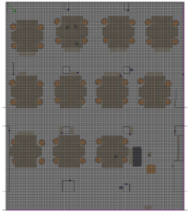
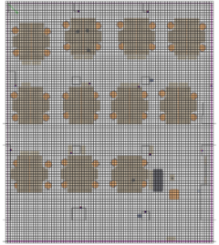
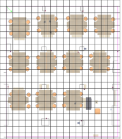

# Grids

The fingerprint histograms are interpolated according to Affine Wasserstein Combination to generate the histograms on unknown positions, as if those are the fingerprint or reference positions. We provide four versions with different resolutions: 0.1, 0.2, 0.5 and 1.0 meters for grid cell size. You can see these grid structures in the following images:

The directory and the file names follow the following pattern:
<pre>&lt;interpolation_type&gt;_&lt;grid_cell_size&gt;/&lt;data_set&gt;_&lt;signal_parameter&gt;_&lt;sensor_mac&gt;_&lt;grid_cell_size&gt;.grd</pre>

Sample file name:
<pre>"wassBest" _ "0.2" / "tetam_rssi" _ "000000000401" _ "0.2" .grd</pre>

The histograms on the grids are estimated by using the Wasserstein interpolation method. The histograms on the grid structure can also be regarded as an estimate for the probabilistic radio frequency map. The researchers that want to use the grid data and the method to interpolate between histograms can cite this article: (Daniş and Cemgil, Sensors, 2017)

The file structure is as follows:
Header:
<pre>&lt;sensor_mac&gt;::&lt;rectangular_limits&gt;::&lt;resolution&gt;::&lt;histogram_bins&gt;</pre>
Lines:
<pre>&lt;2D_grid_coordinate&gt;::&lt;beacon_mac&gt;::&lt;histogram_measures&gt;</pre>
