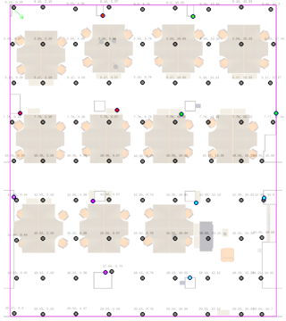

## Fingerprints

Data directory for the fingerprints (or stationary reference histograms): we provide two fingerprint data sets collected from the area: "set_1" and "set_2" collected at different dates. The fingerprint positions (gray dots) for set_1 and set-2 are given respectively in the following images:

### mbd files: multi ble data 
(_multi_ for multiple sensors)

mbd files are the log files that belong to a point in the area. The setup was put on predefined positions in the map and the BLE data were recorded by the system for a specific period.

The data sets consist of the files whose names have the following pattern:
<pre>&lt;sensor_alias&gt;_&lt;pos_x&gt;_&lt;pos_y&gt;_&lt;pos_z&gt;.mbd</pre>

The contents of the files that have the following pattern for each line:
<pre>&lt;timestamp&gt;,&lt;MAC sensor&gt;,&lt;MAC beacon&gt;,&lt;RSSI&gt;</pre>

### hst files: Fingerprints histogram files

Raw BLE data are converted into normalized histograms and recorded in hst files. Each histogram corresponds to a distribution of RSSI values generated by a sensor that captures the Bluetooth packets emitted by a specific transmitter that stands on the specific position.

The lines starting with
- Bins: correspond to a ordered list of decibel values for the following probability measures.
- Dongles: Same as the dongles in the file "tetam.dev"
- Beacons: Same as the beacons in the file "tetam.dev"
- Fingerprints: Nested Python dictionaries in the following format:
<pre>{&lt;3D position&gt;:{&lt;sensor&gt;:{&lt;beacon&gt;:&lt;list of probability measures&gt;, ...}, ... }, ...}</pre>
