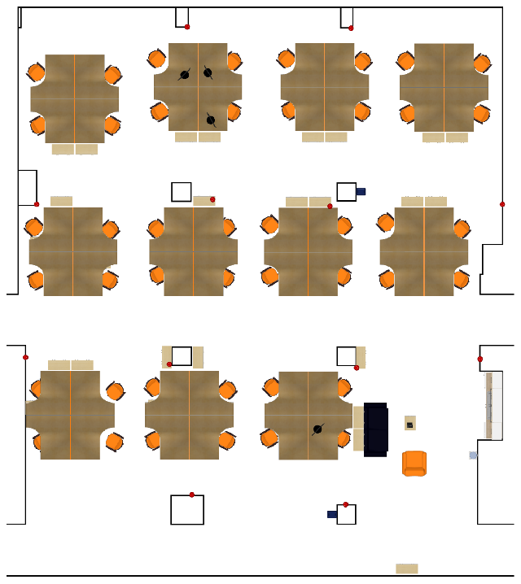
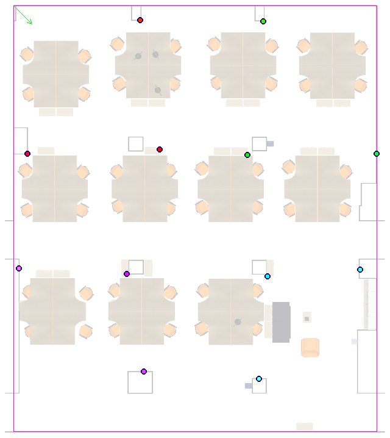

# Area Maps

## tetam.png
Map of the test area. This aerial view image was exported from a 3D illustration of the area by the help of SweetHome3D design software. Pixel-to-metric conversion is possible with the configuration file "tetam.par".

Furnitures, columns and walls are self explanatory. Red dots are the sensor positions.

## tetam_sensors.png
Map of the area where the sensors are color coded, the other obstacles are dimmed and the coordinate system is also shown.

