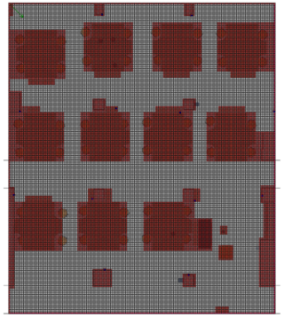

## Occupancy grid maps

We provide the files of occupancy grids at different resolutions, 0.1, 0.2, 0.5 and 1.0 meters per grid cell. If a grid is traversable by a person, or the navigable platform it is marked with 1, or with 0, otherwise. A sample occupancy map visualization for a grid size of 0.1 meters is given in the following image:

File name pattern: 
<pre>&lt;data_set&gt;_&lt;grid_size&gt;.occ</pre>

Header:
<pre>&lt;rectangular_limits&gt;::&lt;grid_size&gt;</pre>
Lines:
<pre>&lt;2D_grid_coordinate&gt;::&lt;occupancy&gt;</pre>

The researchers who want to use these data may cite (Daniş _et al_, 2021).
