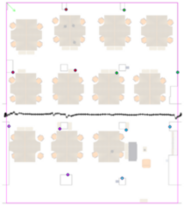
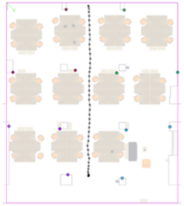
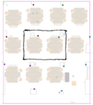
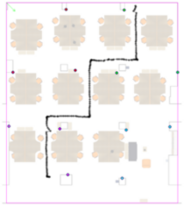

# Track files directory

We provide a set of RSSI values that are collected while navigating through some trajectories. Each sample of RSSI data is labeled with its position counterpart that is estimated via the AR-based positioning system.

Sample trajectory visualizations are shown in the following images:

The directories contain the files for the track logs of the specific trajectory with respect to each sensor. The files in the current directory are the merged versions of the sensor-wise files. The merge operation was performed by respecting the time order.

The file/directory names do not follow a specific pattern. The file/directory names are self explanatory.

Each mbd file consists of the lines that have the following pattern (extended version of the mbd files in the hst directory): 
<pre>&lt;timestamp&gt;,&lt;MAC sensor&gt;,&lt;MAC beacon&gt;,&lt;RSSI&gt;,&lt;coord_x&gt;,&lt;coord_y&gt;,&lt;coord_z&gt;,&lt;3x3 orientation matrix&gt;</pre>

The annotations are performed using a specially designed AR system. The details of the annotation proecss are given in (Daniş _et_al_., PMC, ?). The trajectories are also used in (Daniş _et_al_., Access, 2021). The researchers who want to use these data are expected to cite either of these articles.
